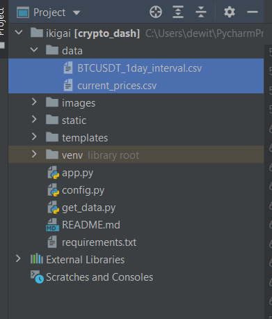

# Crypto Dash

This project uses [python-binance](https://python-binance.readthedocs.io/en/latest/) and [Flask](https://flask.palletsprojects.com/en/2.0.x/).  python-binance is a Python wrapper for the Binance exchange.  Flask is a Python web framework. Currently, the app allows users to view crypto charts and download CSV reports.  To use this app, you will need to have a binance account.

## Installation

- In terminal, add the packages listed in the requirement docs.
   ```bash
    pip install python-binance==1.0.12
   ```
  ```bash
    pip install flask==2.0.1
   ```
  
- In config.py, replace `API_KEY` and `API_SECRET` values with your own binance API key and secret values.  To get the API values read this [article](https://www.binance.com/en/support/faq/360002502072/). 

  Note: `APP_FLASK_SECRET_KEY` should be changed prior to production deployment.  This sets a [session object](https://flask.palletsprojects.com/en/1.0.x/quickstart/#sessions) in Flask.  Error messages, using flash messaging will not work properly without setting this object.  However, if left unchanged, the app will run without having to change this value.

- In terminal, set the `FLASK_APP` [environment
  variable](https://flask.palletsprojects.com/en/2.0.x/quickstart/#tab-0-QmFzaA==).
   ```bash
    set FLASK_APP=app.py
   ```

- In terminal, set the `FLASK_ENV` to development. If you just want to use the app as is, skip this step .  If you want to make changes to the code and see the changes without restarting the server, do this step.
   ```bash
    set FLASK_ENV=development
   ```

- In terminal, to start the server enter
  ```bash
  flask run
  ```
  
### App Pages

- Index


- /balance


- /chart


- chart error message


- chart success message


- returned low time frame chart (5 minutes candles) 


[trading view chart, showing the same](https://www.tradingview.com/chart/?symbol=BITTREX%3AETHBTC)


- returned high time frame chart (daily candles) 


[trading view chart, showing the same](https://www.tradingview.com/chart/?symbol=BITTREX%3AETHBTC)


- /csv 


- location of file



- inside current_prices.csv


## Author

Dewi Tjin

## License

Copyright 2021 DEWI TJIN

Permission is hereby granted, free of charge, to any person obtaining a copy of this software and associated documentation files (the "Software"), to deal in the Software without restriction, including without limitation the rights to use, copy, modify, merge, publish, distribute, sublicense, and/or sell copies of the Software, and to permit persons to whom the Software is furnished to do so, subject to the following conditions:

The above copyright notice and this permission notice shall be included in all copies or substantial portions of the Software.

THE SOFTWARE IS PROVIDED "AS IS", WITHOUT WARRANTY OF ANY KIND, EXPRESS OR IMPLIED, INCLUDING BUT NOT LIMITED TO THE WARRANTIES OF MERCHANTABILITY, FITNESS FOR A PARTICULAR PURPOSE AND NONINFRINGEMENT. IN NO EVENT SHALL THE AUTHORS OR COPYRIGHT HOLDERS BE LIABLE FOR ANY CLAIM, DAMAGES OR OTHER LIABILITY, WHETHER IN AN ACTION OF CONTRACT, TORT OR OTHERWISE, ARISING FROM, OUT OF OR IN CONNECTION WITH THE SOFTWARE OR THE USE OR OTHER DEALINGS IN THE SOFTWARE.
